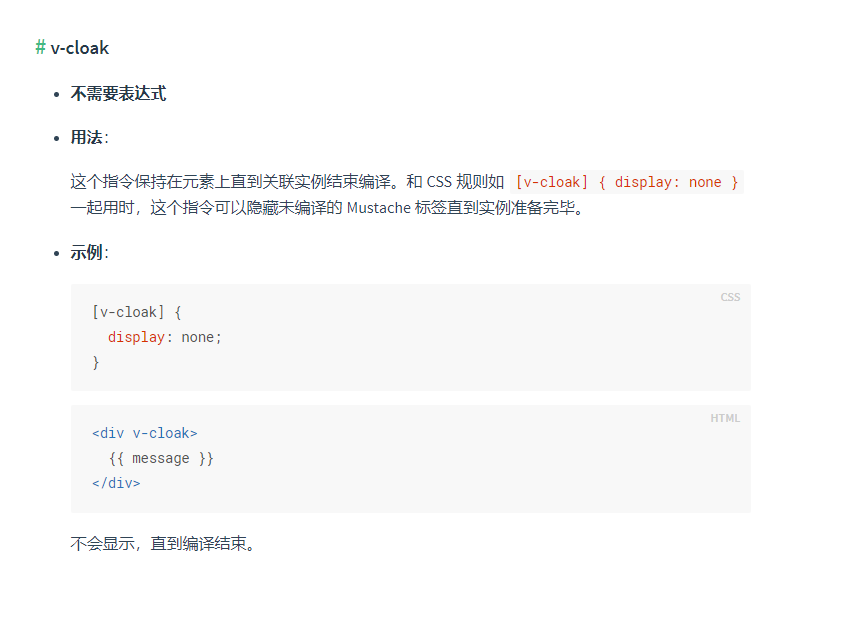

## html通过cdn方式引入[vue](https://so.csdn.net/so/search?q=vue&spm=1001.2101.3001.7020)源文件 页面时刷新 页面显示{{xx}}

**猜想：刷新或是加载时vue源文件加载，页面显示dom，此时vue的模板语法 Mustache 标签的编译还未完成，导致页面显示{{xx}}**

#### 解决



**1.在vue挂在的dom上面添加 v-cloak （最外层dom）**

```html
<div id="page" v-cloak></div>
```

**2.在css中写入**

```css
[v-cloak] {
  display: none;
}
```

