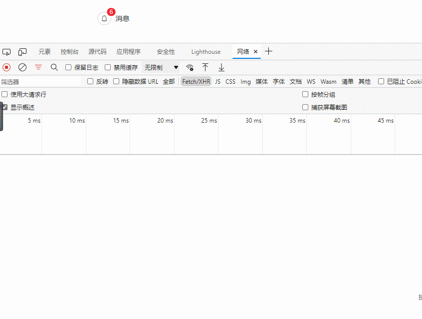

### 什么是消息推送（push）


消息推送(`push`)通常是指网站的运营工作等人员，通过某种工具对用户当前网页或移动设备APP进行的主动消息推送。

消息推送一般又分为`web端消息推送`和`移动端消息推送`。


在具体实现之前，咱们再来分析一下前边的需求，其实功能很简单，只要触发某个事件（主动分享了资源或者后台主动推送消息），web页面的通知小红点就会实时的`+1`就可以了。

通常在服务端会有若干张消息推送表，用来记录用户触发不同事件所推送不同类型的消息，前端主动查询（拉）或者被动接收（推）用户所有未读的消息数。

消息推送无非是推（`push`）和拉（`pull`）两种形式，下边我们逐个了解下。


### 短轮询


轮询(`polling`)应该是实现消息推送方案中最简单的一种，这里我们暂且将轮询分为`短轮询`和`长轮询`。

短轮询很好理解，指定的时间间隔，由浏览器向服务器发出`HTTP`请求，服务器实时返回未读消息数据给客户端，浏览器再做渲染显示。

一个简单的JS定时器就可以搞定，每秒钟请求一次未读消息数接口，返回的数据展示即可。

```javascript
setInterval(() => { 
// 方法请求 
		messageCount().then((res) => {     
			if (res.code === 200) {        
				this.messageCount = res.data     
			} 
})}, 1000);
```

效果还是可以的，短轮询实现固然简单，缺点也是显而易见，由于推送数据并不会频繁变更，无论后端此时是否有新的消息产生，客户端都会进行请求，势必会对服务端造成很大压力，浪费带宽和服务器资源。



### 长轮询

长轮询是对上边短轮询的一种改进版本，在尽可能减少对服务器资源浪费的同时，保证消息的相对实时性。长轮询在中间件中应用的很广泛，比如`Nacos`和`apollo`配置中心，消息队列`kafka`、`RocketMQ`中都有用到长轮询。


### iframe流

iframe流就是在页面中插入一个隐藏的`<iframe>`标签，通过在`src`中请求消息数量API接口，由此在服务端和客户端之间创建一条长连接，服务端持续向`iframe`传输数据。传输的数据通常是`HTML`、或是内嵌的`javascript`脚本，来达到实时更新页面的效果。

这种方式实现简单，前端只要一个`<iframe>`标签搞定了

```javascript
<iframe src="/iframe/message" style="display:none"></iframe>
```

但我个人不推荐，因为它在浏览器上会显示请求未加载完，图标会不停旋转，简直是强迫症杀手。


### SSE 

`SSE`它是基于`HTTP`协议的，我们知道一般意义上的HTTP协议是无法做到服务端主动向客户端推送消息的，但SSE是个例外，它变换了一种思路。

SSE在服务器和客户端之间打开一个单向通道，服务端响应的不再是一次性的数据包而是`text/event-stream`类型的数据流信息，在有数据变更时从服务器流式传输到客户端。

整体的实现思路有点类似于在线视频播放，视频流会连续不断的推送到浏览器，你也可以理解成，客户端在完成一次用时很长（网络不畅）的下载。

`SSE`与`WebSocket`作用相似，都可以建立服务端与浏览器之间的通信，实现服务端向客户端推送消息，但还是有些许不同：


- SSE 是基于HTTP协议的，它们不需要特殊的协议或服务器实现即可工作；`WebSocket`需单独服务器来处理协议。
- SSE 单向通信，只能由服务端向客户端单向通信；webSocket全双工通信，即通信的双方可以同时发送和接受信息。
- SSE 实现简单开发成本低，无需引入其他组件；WebSocket传输数据需做二次解析，开发门槛高一些。
- SSE 默认支持断线重连；WebSocket则需要自己实现。
- SSE 只能传送文本消息，二进制数据需要经过编码后传送；WebSocket默认支持传送二进制数据。

**SSE 与 WebSocket 该如何选择？**


> 技术并没有好坏之分，只有哪个更合适


SSE好像一直不被大家所熟知，一部分原因是出现了WebSockets，这个提供了更丰富的协议来执行双向、全双工通信。对于游戏、即时通信以及需要双向近乎实时更新的场景，拥有双向通道更具吸引力。

但是，在某些情况下，不需要从客户端发送数据。而你只需要一些服务器操作的更新。比如：站内信、未读消息数、状态更新、股票行情、监控数量等场景，`SEE`不管是从实现的难易和成本上都更加有优势。此外，SSE 具有`WebSockets`在设计上缺乏的多种功能，例如：`自动重新连接`、`事件ID`和`发送任意事件`的能力。

前端只需进行一次HTTP请求，带上唯一ID，打开事件流，监听服务端推送的事件就可以了

```
<script>        
let source = null;        
let userId = 7777    
if (window.EventSource) {              
// 建立连接       
source = new EventSource('http://localhost:7777/sse/sub/'+userId);        
setMessageInnerHTML("连接用户=" + userId);        
/**         * 连接一旦建立，就会触发open事件         * 另一种写法：source.onopen = function (event) {}         */  
source.addEventListener('open', function (e) {         
setMessageInnerHTML("建立连接。。。");       
}, false);      
/**         * 客户端收到服务器发来的数据         * 另一种写法：source.onmessage = function (event) {}         */ 
source.addEventListener('message', function (e) {     
setMessageInnerHTML(e.data);       
});    } else {             
setMessageInnerHTML("你的浏览器不支持SSE");  }
</script>
```

我们模拟服务端推送消息，看下客户端收到了消息，和我们预期的效果一致。


**注意：** SSE不支持`IE`浏览器，对其他主流浏览器兼容性做的还不错。

### Websocket

`websocket`应该是大家都比较熟悉的一种实现消息推送的方式，上边我们在讲SSE的时候也和websocket进行过比较。


WebSocket是一种在`TCP`连接上进行全双工通信的协议，建立客户端和服务器之间的通信渠道。浏览器和服务器仅需一次握手，两者之间就直接可以创建持久性的连接，并进行双向数据传输。


springboot整合websocket，先引入`websocket`相关的工具包，和SSE相比额外的开发成本。

前端初始化打开WebSocket连接，并监听连接状态，接收服务端数据或向服务端发送数据。


```javascript
 // 监听并处理error事件   
 ws.onerror = function (error) {      
 console.log(error);  
 }          
 function sendMessage() {            
 var content = $("#message").val();     
 $.ajax({      
 url: '/socket/publish?userId=10086&message=' + content,     
 type: 'GET',      
 data: { "id": "7777", "content": content },     
 success: function (data) {        
 console.log(data)        
 }     
 })  
 }
 </script>
```

页面初始化建立websocket连接，之后就可以进行双向通信了，效果还不错


